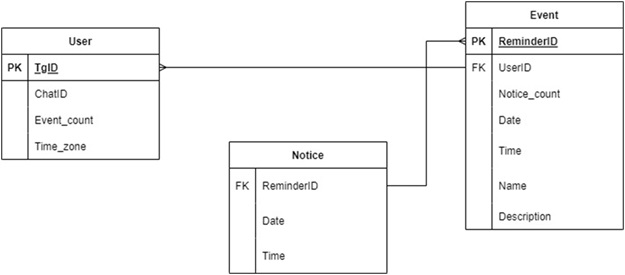

# Техническое задание на выполнение работ по созданию телеграмм-бота, напоминающего пользователю о запланированных мероприятиях

## Оглавление
1. [Описание терминов](#1-описание-терминов)
   - [Список терминов](#11-список-терминов)
   - [Список сокращений](#12-список-сокращений)
2. [Продуктовое описание](#2-продуктовое-описание)
   - [Основные сценарии использования](#21-основные-сценарии-использования)
   - [Функциональные требования](#22-функциональные-требования)
     - [Регистрация и авторизация](#221-регистрация-и-авторизация)
     - [Создание напоминаний](#222-создание-напоминаний)
     - [Редактирование и удаление](#223-редактирование-и-удаление)
     - [Уведомления и напоминания](#224-уведомления-и-напоминания)
     - [Просмотр списка напоминаний](#225-просмотр-списка-напоминаний)
     - [Ограничения](#226-ограничения)
3. [Техническое описание](#3-техническое-описание)
   - [Взаимодействие с Telegram API](#31-взаимодействие-с-telegram-api)
   - [API для взаимодействия пользователя с ТГБ](#32-api-для-взаимодействия-пользователя-с-тгб)
   - [Технические детали](#33-технические-детали)
     - [Стек технологий](#331-стек-технологий)
     - [Архитектура](#332-архитектура)
     - [ХД](#33-хд)
4. [Условия эксплуатации продукта](#4-условия-эксплуатации-продукта)
   - [Программная среда](#41-программная-среда)
   - [Аппаратные требования](#42-аппаратные-требования)
   - [Сетевое подключение](#43-сетевое-подключение)
   - [Нагрузочные условия](#44-нагрузочные-условия)
   - [Эксплуатационные риски](#45-эксплуатационные-риски)
   - [Доступность и время работы](#46-доступность-и-время-работы)
   - [Требования к поддержке](#47-требования-к-поддержке)
5. [Контактная информация](#5-контактная-информация)

---

## 1 Описание терминов

### 1.1 Список терминов

| Термин      | Определение |
|------------|------------|
| **API** | Application Programming Interface (API) – программный интерфейс приложения, интерфейс прикладного программирования. Описание способов (набор классов, процедур, функций, структур или констант), которыми одна компьютерная программа может взаимодействовать с другой программой. |
| **BPMN** | Business Process Model and Notation – нотация и модель бизнес-процессов, система условных обозначений и их описания в XML для моделирования бизнес-процессов. |
| **ChatID** | Идентификатор чата в Телеграме. |
| **GUI** | Graphical User Interface – разновидность пользовательского интерфейса, в котором элементы интерфейса (меню, кнопки, значки, списки и т. п.), представленные пользователю на дисплее, исполнены в виде графических изображений. |
| **REST** | Representational State Transfer – «передача состояния представления». Архитектурный стиль взаимодействия компонентов распределённого приложения в сети. |
| **SOA** | Service-Oriented Architecture (сервис-ориентированная архитектура) – архитектурный стиль, в котором бизнес-системы и ИТ-системы разрабатываются с точки зрения служб, доступных через интерфейс, и результатов действий этих служб. Служба – это логическое представление набора действий, порождающих заданные результаты; служба является автономной, может состоять из других служб, при этом потребители данной службы не обязаны знать её внутреннюю структуру. |
| **Telegram ID** | Уникальный числовой идентификатор пользователя в Телеграме, который не меняется. Все сообщения, команды и колбэки бота привязываются к этому ID. |
| **UML** | Unified Modeling Language – унифицированный язык моделирования, система обозначений, которую можно применять для объектно-ориентированного анализа и проектирования. |
| **Напоминание** | Сообщение в чате ТГБ с пользователем, уведомляющее о предстоящем событии. |
| **Событие** | Запланированное пользователем мероприятие, которое он сохраняет в ТГБ, с указанием даты и времени предстоящего мероприятия. |
| **Чат** | Функция (пространство), позволяющая общаться с помощью текстовых сообщений, обмениваться аудио- и видеофайлами. |

### 1.2 Список сокращений

| Сокращение | Расшифровка |
|------------|------------|
| **БД** | База данных |
| **ОС** | Операционная система |
| **ПО** | Программное обеспечение |
| **СУБД** | Система управления базами данных |
| **СХД** | Система хранения данных |
| **ЦОД** | Центр обработки данных |
| **ЭВМ** | Электронно-вычислительная машина |
| **ТГ** | Телеграм |
| **ТГБ** | Телеграм-бот |

---

## 2 Продуктовое описание
Telegram-бот предназначен для организации и автоматизации напоминаний о запланированных мероприятиях. Пользователи могут добавлять события, указывать дату и время напоминания, а бот отправит уведомление в нужный момент.

### 2.1 Основные сценарии использования:
1. Пользователь создает напоминание о событии через команду в боте или клавиатурное меню.
2. Бот сохраняет данные и отправляет уведомление в указанное время.
3. Возможность управлять событиями: редактировать, удалять и просматривать запланированные напоминания.

Взаимодействие пользователя с ТГБ осуществляется с помощью кнопок или команд. Описание команд представлено в разделе [API для взаимодействия пользователя с ТГБ](#32-api-для-взаимодействия-пользователя-с-тгб). Для каждой команды есть соответствующая кнопка в меню.

### 2.2 Функциональные требования
#### 2.2.1 Регистрация и авторизация
Использование Telegram ID для идентификации пользователя.

#### 2.2.2 Создание напоминаний
Создание напоминания с указанием:
- Даты и времени события.
- Даты и времени уведомления.
- Названия и описания события.

#### 2.2.3 Редактирование и удаление
- Изменение даты, времени, описания, названия, даты и времени уведомления.
- Удаление напоминания.

#### 2.2.4 Уведомления и напоминания
- Бот отправляет сообщение пользователю в указанный момент.
- Возможность выбора времени напоминания (за 10 минут, за 1 час и т. д.).

#### 2.2.5 Просмотр списка напоминаний
Просмотр всех запланированных напоминаний.

#### 2.2.6 Ограничения
Лимиты на количество напоминаний для одного пользователя (10 напоминаний).

#### 2.2.7 Сценарии использования
На изображении 2.1 представлена BPMN-диаграмма процесса создания события.  

На изображении 2.2 представлена BPMN-диаграмма процесса создания напоминания.

На изображении 2.3 представлена BPMN-диаграмма процесса редактирования события.

На изображении 2.4 представлена BPMN-диаграмма процесса удаления события.

На изображении 2.5 представлена BPMN-диаграмма процесса просмотра событий.

---

## 3 Техническое описание
### 3.1 Взаимодействие с Telegram API
Использование Telegram Bot API для отправки и получения сообщений.

### 3.2 API для взаимодействия пользователя с ТГБ
- `/add` — создание напоминания.
- `/get` — получение списка напоминаний.
- `/choose {название события}` — режим работы с конкретным напоминанием по названию события:
  - `/get` — получить информацию.
  - `/fix` — редактировать информацию.
  - `/delete` — удалить напоминание.
- `/delete` — удалить все напоминания.

Для повышения удобства использования бота необходимо реализовать интерактивное меню, позволяющее пользователю быстро получать доступ к основным функциям без необходимости вводить команды вручную.

### 3.3 Технические детали
#### 3.3.1 Стек технологий
- Язык программирования: Python 3.11+.
- Библиотекадляpython python-telegram-bot 21.10.
- База данных: PostgreSQL 16.8.
- API: Telegram Bot API.
- Система версионного контроля: GitHub
- Инструмент управления проектом: Jira
#### 3.3.2 Архитектура
 Клиент (Telegram-бот) → Backend (сервер обработки напоминаний) → База данных.

#### 3.3 ХД
В качестве системы ХД выбрана БД, взаимодействие с которой будет осуществляться с помощью СУБД PostgreSQL.На рисунке 3.1 предоставлена ER-диаграмма БД.

#### Таблица 1 Описание таблицы Users
| Поле       | Тип    | Содержание |
|------------|-------|------------|
| TgID	| Строка	| Уникальный числовой идентификатор пользователя в ТГ, который не меняется. Все сообщения, команды и колбэки бота привязываются к этому ID
|ChatID	| Строка	| Идентификатор чата в ТГ
|Event_count	| Целое число	| Количество доступных событий для запоминания ТГБ
|Time_zone	| Целое число	| Часовой пояс пользователя относительно гринвича.

#### Таблица 2 Описание таблицы Event
| Поле       | Тип    | Содержание |
|------------|-------|------------|
|ReminderID |	Строка |	Уникальный ID события
|UserID |	Строка |	Идентификатор чата в ТГ. Бот использует его для отправки сообщений
|Notice_count |	Целое число |	Количество доступных для добавления напоминаний
|Date |	Дата |	Дата события
|Time |	Время |	Время события
|Name |	Строка |	Название события
|Description |	Строка |	Описание события
 
#### Таблица 3 Описание таблицы Notice
| Поле       | Тип    | Содержание |
|------------|-------|------------|
|ReminderID | Строка |ID события
|Date | Дата |	Дата напоминания
|Time | Время |	Время напоминания

### 3.4 Описание ошибок и исключений
- Введена некорректная дата.
- Дата уведомления позже даты события.
- Событие с таким именем уже существует (при создании и редактировании события)
- Такое уведомление уже создано
- Событие с таким именем не существует (при попытке обращения к несуществующему событию)
- Такого уведомления нет
- Нет доступных напоминаний
- Нет доступных уведомлений для события
- У события нет установленных уведомлений

### 3.5 Описание ограничений
- Максимальная длина текста описания события 50 символов
- Максимальная длина имени события 20 символов
- Минимальное время уведомления о событии до начала (5 минут до начала события)
- Максимальное количество уведомлений для одного события 10
- Минимальное время, доступное для создания уведомления (текущее время + 10 мин)

### 3.6 Дизайн меню ТГБ

## 4 Условия эксплуатации продукта
Telegram-бот для напоминаний будет эксплуатироваться в условиях, зависящих от следующих факторов:
### 4.1 Программная среда
Бот работает в экосистеме Telegram, доступен через мобильные приложения (iOS, Android), десктопные клиенты (Windows, macOS, Linux) и веб-версию.
### 4.2 Аппаратные требования
Поддержка работы на устройствах пользователей без требований к производительности, так как взаимодействие происходит через Telegram.
### 4.3 Сетевое подключение
- Бот требует постоянного интернет-соединения для работы с Telegram API.
- Минимальные требования к скорости соединения, но возможны задержки при высокой нагрузке на сервер.
- Возможна работа в мобильных сетях (3G, 4G, 5G) и Wi-Fi.
### 4.4 Нагрузочные условия
- Поддержка многопользовательского режима.
- Использование механизма асинхронного взаимодействия для обработки большого числа напоминаний одновременно.
### 4.5 Эксплуатационные риски
- Сбои в работе Telegram API (например, временная недоступность сервиса).
- Ошибка пользователя (например, указание неправильной даты или времени).
- Ограничения пропускной способности Telegram (например, задержкипри отправке сообщений).
- Сбой сервера.
- Перегрузка сервера из-за большого числа пользователей.
- Ошибки в коде.
- Изменение Telegram API.
- Злоумышленники или спам-атаки.
- Потеря данных при обновлениях.
- Утечка данных пользователей.
- Блокировка бота администрацией Telegram.
- Сбой в работе базы данных.

[Таблица рисков](img/risk.md)

### 4.6 Доступность и время работы
- Бот работает круглосуточно (24/7) при наличии доступности API.
- Время ответа бота зависит от Telegram API, но в нормальных условиях не превышает 1-3 секунд.
### 4.7 Требования к поддержке
Мониторинг работы через логирование событий и автоматические уведомления об ошибках.

## 5 Контактная информация
- Сёмина Анна (ИУ7-83Б) – @cutie_cactus
- Лазутин Александр (ИУ7-83Б) – @Sksjdjcj
- Горынкин Андрей (ИУ7-83Б) –@andrew97397
