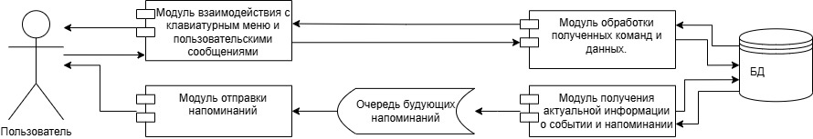

# Техническое задание на выполнение работ по созданию телеграмм-бота, напоминающего пользователю о запланированных мероприятиях

## Оглавление
1. [Описание терминов](#1-описание-терминов)
   - [Список терминов](#11-список-терминов)
   - [Список сокращений](#12-список-сокращений)
2. [Продуктовое описание](#2-продуктовое-описание)
   - [Основные сценарии использования](#21-основные-сценарии-использования)
   - [Функциональные требования](#22-функциональные-требования)
     - [Регистрация и авторизация](#221-регистрация-и-авторизация)
     - [Создание напоминаний](#222-создание-напоминаний)
     - [Редактирование и удаление](#223-редактирование-и-удаление)
     - [Уведомления и напоминания](#224-уведомления-и-напоминания)
     - [Просмотр списка напоминаний](#225-просмотр-списка-напоминаний)
     - [Ограничения](#226-ограничения)
3. [Техническое описание](#3-техническое-описание)
   - [Взаимодействие с Telegram API](#31-взаимодействие-с-telegram-api)
   - [API для взаимодействия пользователя с ТГБ](#32-api-для-взаимодействия-пользователя-с-тгб)
   - [Технические детали](#33-технические-детали)
     - [Стек технологий](#331-стек-технологий)
     - [Архитектура](#332-архитектура)
     - [ХД](#33-хд)
4. [Условия эксплуатации продукта](#4-условия-эксплуатации-продукта)
   - [Программная среда](#41-программная-среда)
   - [Аппаратные требования](#42-аппаратные-требования)
   - [Сетевое подключение](#43-сетевое-подключение)
   - [Нагрузочные условия](#44-нагрузочные-условия)
   - [Эксплуатационные риски](#45-эксплуатационные-риски)
   - [Доступность и время работы](#46-доступность-и-время-работы)
   - [Требования к поддержке](#47-требования-к-поддержке)
5. [Контактная информация](#5-контактная-информация)

---

## 1 Описание терминов

### 1.1 Список терминов

| Термин      | Определение |
|------------|------------|
| **API** | Application Programming Interface (API) – программный интерфейс приложения, интерфейс прикладного программирования. Описание способов (набор классов, процедур, функций, структур или констант), которыми одна компьютерная программа может взаимодействовать с другой программой. |
| **BPMN** | Business Process Model and Notation – нотация и модель бизнес-процессов, система условных обозначений и их описания в XML для моделирования бизнес-процессов. |
| **ChatID** | Идентификатор чата в Телеграме. |
| **GUI** | Graphical User Interface – разновидность пользовательского интерфейса, в котором элементы интерфейса (меню, кнопки, значки, списки и т. п.), представленные пользователю на дисплее, исполнены в виде графических изображений. |
| **REST** | Representational State Transfer – «передача состояния представления». Архитектурный стиль взаимодействия компонентов распределённого приложения в сети. |
| **SOA** | Service-Oriented Architecture (сервис-ориентированная архитектура) – архитектурный стиль, в котором бизнес-системы и ИТ-системы разрабатываются с точки зрения служб, доступных через интерфейс, и результатов действий этих служб. Служба – это логическое представление набора действий, порождающих заданные результаты; служба является автономной, может состоять из других служб, при этом потребители данной службы не обязаны знать её внутреннюю структуру. |
| **Telegram ID** | Уникальный числовой идентификатор пользователя в Телеграме, который не меняется. Все сообщения, команды и колбэки бота привязываются к этому ID. |
| **UML** | Unified Modeling Language – унифицированный язык моделирования, система обозначений, которую можно применять для объектно-ориентированного анализа и проектирования. |
| **Напоминание** | Сообщение в чате ТГБ с пользователем, уведомляющее о предстоящем событии. |
| **Событие** | Запланированное пользователем мероприятие, которое он сохраняет в ТГБ, с указанием даты и времени предстоящего мероприятия. |
| **Чат** | Функция (пространство), позволяющая общаться с помощью текстовых сообщений, обмениваться аудио- и видеофайлами. |
| **URL**	| (Uniform Resource Locator) — это адрес, используемый для доступа к ресурсам в интернете.
| **TOKEN** | Уникальный ключ, который используется для аутентификации запросов к Telegram Bot API.
| Тег |Имя пользователя в Telegram, которое начинается с @.
| **BotFather** | Официальный бот Telegram, предназначенный для создания и управления другими ботами. С его помощью можно получить TOKEN, настроить описание, команды и параметры работы бота.

### 1.2 Список сокращений

| Сокращение | Расшифровка |
|------------|------------|
| **БД** | База данных |
| **ОС** | Операционная система |
| **ПО** | Программное обеспечение |
| **СУБД** | Система управления базами данных |
| **СХД** | Система хранения данных |
| **ЦОД** | Центр обработки данных |
| **ЭВМ** | Электронно-вычислительная машина |
| **ТГ** | Телеграм |
| **ТГБ** | Телеграм-бот |

---

## 2 Продуктовое описание
Telegram-бот предназначен для организации и автоматизации напоминаний о запланированных мероприятиях. Пользователи могут добавлять события, указывать дату и время напоминания, а бот отправит уведомление в нужный момент.

### 2.1 Основные сценарии использования:
1.	Пользователь может создать событие, указав его дату, время начала, название и описание события.
2.	Пользователь может создать напоминание о событии, указав его дату и время, которое будет добавлено в это напоминание.
3.	Пользователь может редактировать параметры ранее созданного события.
4.	Пользователь может удалить ранее созданное события.
5.	Пользователь может удалить напоминание о событии.
6.	Пользователь может посмотреть ранее созданные события и напоминания к ним.

Ниже приведены BPMN диаграммы с описанием сценариев использования ТГБ.

На изображении 2.1 представлена BPMN-диаграмма процесса создания события.  

На изображении 2.2 представлена BPMN-диаграмма процесса создания напоминания.

На изображении 2.3 представлена BPMN-диаграмма процесса редактирования события.

На изображении 2.4 представлена BPMN-диаграмма процесса удаления события.

На изображении 2.5 представлена BPMN-диаграмма процесса просмотра событий.

### 2.2 Функциональные требования
#### 2.2.1 Регистрация и авторизация
Для регистрации и идентификации пользователя используется Telegram ID.

#### 2.2.2 Создание событий
Для событий существуют следующие ограничения:
- каждое событие обязательно должно содержать дату, время и название события;
- один пользователь может одновременно иметь не более 10 запланированных событий;
- дата вводится в формате ГГГГ-ММ-ДД;
- событие не может быть задано на уже прошедшую дату;
- время вводится в формате ЧЧ:ММ;
- событие не может быть задано на уже прошедшее время;
- максимальная длина названия события 50 символов;
- максимальная длина текста описания события 250 символов.

#### 2.2.3	Создание напоминаний о событиях

Для напоминаний существуют следующие ограничения:
- каждое напоминание обязательно должно содержать дату и время;
- пользователь может создать не более 10 напоминаний к одному событию;
- дата вводится в формате ГГГГ-ММ-ДД;
- напоминание не может быть задано на уже прошедшую дату;
- время вводится в формате ЧЧ:ММ;
- напоминание не может быть задано на уже прошедшее время;
- пользователь сам решает в какое время должно быть доставлено напоминание;
- напоминания доставляются пользователю с точностью до минуты;
- напоминание может быть задано на время не позже, чем 5 минут до начала события;
- ТГБ отправляет только те напоминания, которые добавил пользователь;
- каждое напоминание отправляется только 1 раз (без каких-либо условий для повторной отправки).

#### 2.2.4	Удаление событий и напоминаний
При удалении события или напоминания пользователем, у него дополнительно спрашивается, уверен ли он в удалении события/напоминания, так как оно безвозвратно удаляется из БД, возможность восстановить отсутствует.

### 2.3	Описание ошибок и исключений
- Введена некорректная дата
- Дата уведомления позже даты события
- Событие с таким именем уже существует (при создании и редактировании события)
- Такое уведомление уже создано
- Событие с таким номером не существует (при попытке обращения к несуществующему событию)
- Такого уведомления нет
- Нет доступных напоминаний
- Нет доступных событий
- Нет доступных напоминаний для события

---

## 3 Техническое описание
### 3.1 Взаимодействие с Telegram API
Использование Telegram Bot API для отправки и получения сообщений.

#### 3.1.1	Регистрация бота
Бот авторизуется с помощью уникального токена, который выдается при его регистрации через @BotFather. Имя ТГБ – ReminderBot, тег ТГБ - @ReminderDataBot.

#### 3.1.2	Обработка входящих сообщений
Взаимодействие с пользователя с ботом осуществляется с помощью клавиатурного меню и пользовательского ввода.

Главное клавиатурное меню:
- Get – получение списка всех событий пользователя.
- Add – добавление нового события.
- Info – получение информации о боте и о функционале главного клавиатурного меню.
- Choose – выбор имеющегося события и последующая работа с указанным событием в клавиатурном меню события.
- Delete – удаление всех событий пользователя.

Клавиатурное меню события:
- Get – получение списка всех напоминаний у выбранного события.
- Fix – выборочное изменение события.
- Info – вывод информации о функционале клавиатурного меню события.
- Delete event – удаление выбранного события
- Delete notice – выбор напоминания и его удаление.
- Back – возврат в главное меню.

Клавиатурное меню отмены действия:
- Cancel – отмена выбранного действия и возврат в меню, из которого оно было вызвано.

Клавиатурное меню изменения события:
- Cancel – отмена выбранного действия и возврат в меню, из которого оно было вызвано.
- Next – отмена изменения указанного поля события и переход к изменению следующего поля.

Текст, вводимы пользователем, анализируется с помощью состояний. Состояния бота изменяются по средством нажатий на клавиатурное меню и очередности вводимых сообщений. Если пользователь ввел сообщение при пустом состоянии, вывод сообщения «Неизвестная команда». 

#### 3.1.3	Состояния ТГБ
Для управления состояниями пользователя используется context.user_data — это словарь, хранящий данные отдельно для каждого пользователя. Каждому пользователю выделяется свой context.user_data, привязанный к user_id. Данные сохраняются только в рамках текущей сессии (бот забывает их при перезапуске).

Используемые состояния:
- *waiting_for_date* Бот ожидает ввода даты. Дата должна быть введена в формате "ГГГГ-ММ-ДД". Если формат неверный, бот повторно запросит ввод.
- *waiting_for_time* Бот ожидает ввода времени. Время должно быть указано в формате "ЧЧ:ММ". Если введённое значение не соответствует формату, бот запросит его снова.
- *waiting_for_name* Бот ожидает ввода названия события. 
- *waiting_for_description* Бот ожидает ввода описания события. 
- *waiting_for_delete_all* Бот ожидает подтверждения удаления всех событий. Ожидаемый ответ: "Да" для подтверждения или иное слово для отмены. 
- *waiting_for_delete_event* Бот ожидает подтверждения удаления события. Ожидаемый ответ: "Да" для подтверждения или иное слово для отмены. 
- *waiting_for_delete_notice_number* Бот ожидает номер напоминания для удаления. Если номер некорректный или не существует, бот попросит ввести его заново.
- *waiting_for_delete_notice* Бот ожидает подтверждения удаления напоминания. Ожидаемый ответ: "Да" для подтверждения или иное слово для отмены. 
- *waiting_for_event* Бот ожидает выбора события из списка. Если пользователь введёт некорректное значение, бот запросит ввод снова.
- *waiting_for_date_notice_choose* Бот ожидает выбора даты для напоминания. Дата должна быть в формате "ГГГГ-ММ-ДД". Если введено неверное значение, бот попросит повторить ввод.
- *waiting_for_time_notice_choose* Бот ожидает выбора времени для напоминания. Время должно быть в формате "ЧЧ:ММ". Если введено неверное значение, бот запросит ввод снова.
- *waiting_for_fix_date* Бот ожидает нового значения даты для редактирования события. Дата должна быть в формате "ГГГГ-ММ-ДД". Если введённое значение некорректное, бот попросит повторить ввод.
- *waiting_for_fix_time* Бот ожидает нового времени для редактирования события. Время должно быть в формате "ЧЧ:ММ". Если введено неверное значение, бот повторит запрос.
- *waiting_for_fix_name* Бот ожидает нового названия события. 
- *waiting_for_fix_description* Бот ожидает нового описания события. 

#### 3.1.4 Используемые методы Telegram Bot API
Для взаимодействия бота с пользователем используются следующие методы Telegram Bot API:
- sendMessage – отправка текстовых сообщений пользователю. 
- context.user_data – хранение данных пользователя между обработчиками сообщений. Используется для хранения состояния диалога и других временных данных.
- context.job_queue.run_once – планирование отложенных задач. Используется для отправки напоминаний пользователю через определённый промежуток времени:
- app.add_handler(CommandHandler()) – добавление обработчика для команды. 
- app.add_handler(MessageHandler()) – добавление обработчика для текстового сообщения.

Эти методы обеспечивают корректную работу бота, позволяя ему обрабатывать пользовательские команды, сохранять состояние диалога и отправлять уведомления в нужное время.

### 3.2 Технические детали
#### 3.2.1	Стек технологий
- Язык программирования: Python 3.11+.
- Библиотекадляpython python-telegram-bot 21.10.
- База данных: PostgreSQL 16.8.
- API: Telegram Bot API.
- Система версионного контроля: GitHub
- Инструмент управления проектом: Jira

#### 3.3.2 Архитектура

На рисунке представлена архитектура системы напоминаний для ТГБ.

#### 3.3 ХД
В качестве системы ХД выбрана БД, взаимодействие с которой будет осуществляться с помощью СУБД PostgreSQL. На рисунке 3.2 предоставлена ER-диаграмма БД.

#### Таблица 1 Описание таблицы Users
| Поле       | Тип    | Содержание |
|------------|-------|------------|
| TgID	| Строка	| Уникальный числовой идентификатор пользователя в ТГ, который не меняется. Все сообщения, команды и колбэки бота привязываются к этому ID
|ChatID	| Строка	| Идентификатор чата в ТГ
|Event_count	| Целое число	| Количество доступных событий для запоминания ТГБ
|Time_zone	| Целое число	| Часовой пояс пользователя относительно гринвича.

#### Таблица 2 Описание таблицы Event
| Поле       | Тип    | Содержание |
|------------|-------|------------|
|EventID |	Целое число |	Уникальный ID события
|UserID |	Строка |	Идентификатор чата в ТГ. Бот использует его для отправки сообщений
|Notice_count |	Целое число |	Количество доступных для добавления напоминаний
|Date |	Дата |	Дата события
|Time |	Время |	Время события
|Name |	Строка |	Название события
|Description |	Строка |	Описание события
 
#### Таблица 3 Описание таблицы Notice
| Поле       | Тип    | Содержание |
|------------|-------|------------|
|NoticeID | Целое число |ID напоминания
|EventID | Целое число |ID события
|Date | Дата |	Дата напоминания
|Time | Время |	Время напоминания

---

## 4 Условия эксплуатации продукта
Telegram-бот для напоминаний будет эксплуатироваться в условиях, зависящих от следующих факторов:
### 4.1 Программная среда
Бот работает в экосистеме Telegram, доступен через мобильные приложения (iOS, Android), десктопные клиенты (Windows, macOS, Linux) и веб-версию.
### 4.2 Аппаратные требования
Поддержка работы на устройствах пользователей без требований к производительности, так как взаимодействие происходит через Telegram.
### 4.3 Сетевое подключение
- Бот требует постоянного интернет-соединения для работы с Telegram API.
- Минимальные требования к скорости соединения, но возможны задержки при высокой нагрузке на сервер.
- Возможна работа в мобильных сетях (3G, 4G, 5G) и Wi-Fi.
### 4.4 Нагрузочные условия
- Поддержка многопользовательского режима.
- Использование механизма асинхронного взаимодействия для обработки большого числа напоминаний одновременно.
### 4.5 Эксплуатационные риски
- Сбои в работе Telegram API (например, временная недоступность сервиса).
- Ошибка пользователя (например, указание неправильной даты или времени).
- Ограничения пропускной способности Telegram (например, задержки при отправке сообщений).
- Сбой сервера.
- Перегрузка сервера из-за большого числа пользователей.
- Ошибки в коде.
- Изменение Telegram API.
- Злоумышленники или спам-атаки.
- Потеря данных при обновлениях.
- Утечка данных пользователей.
- Блокировка бота администрацией Telegram.
- Сбой в работе базы данных.

[Таблица рисков](img/risk.md)

### 4.6 Доступность и время работы
- Бот работает круглосуточно (24/7) при наличии доступности API.
- Время ответа бота зависит от Telegram API, но в нормальных условиях не превышает 1-3 секунд.
### 4.7 Требования к поддержке
Мониторинг работы через логирование событий и автоматические уведомления об ошибках.

## 5 Контактная информация
- Сёмина Анна (ИУ7-83Б) – @cutie_cactus
- Лазутин Александр (ИУ7-83Б) – @Sksjdjcj
- Горынкин Андрей (ИУ7-83Б) –@andrew97397
